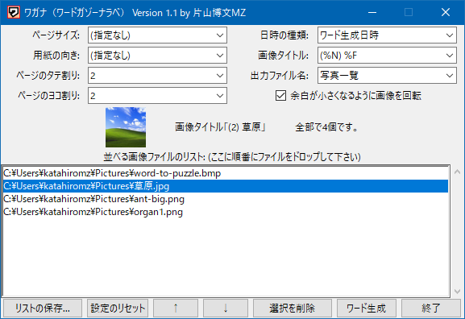

#  ワガナ by 片山博文MZ

「ワガナ」（ワード画像並べ）は、複数の画像を格子状に並べてワード文書ファイル（docx）にするソフトです。

基本操作は、画像ファイルをリストに追加して「ワード生成」ボタンを押すだけです。

完成したワードファイルはデスクトップに作成されます。画像を並べるだけの作業なら、ワガナをお使い下さい。

## 対応環境

- 日本語 Windows 10 / Windows 11

※ 一部対応していない画像形式があります。

## 使用許諾

フリーソフト（MITライセンス）として配布します。このプログラムを使って生じた如何なる損害も当方は責任を負いません。

## 更新履歴

- 2024-05-29 Ver.1.0
    - 初公開。
- 2024-06-03 Ver.1.1
    - リスト保存に拡張子.txtを追加。
    - 劇的にいろいろ改良。
- 2024-XX-YY Ver.1.2
    - アイコンの改良。

## 連絡先

Twitter [@katahiromz](https://twitter.com/katahiromz) か電子メール katayama.hirofumi.mz@gmail.com でご連絡下さい。

ホームページ：[https://katahiromz.web.fc2.com/](https://katahiromz.web.fc2.com/)
